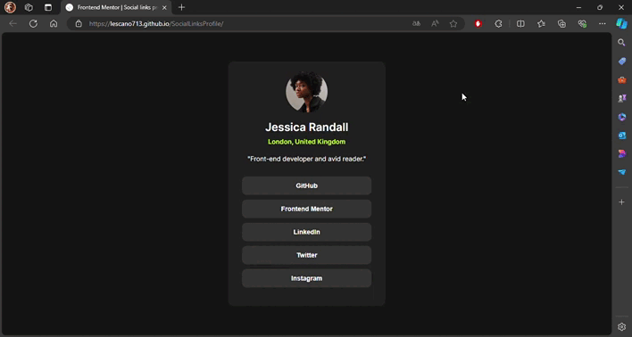

# Frontend Mentor - Social links profile solution

<div align="left">
  <a href="https://www.linkedin.com/in/danae-lescano-salvatierra" target="_blank">
    
  </a>
  <a href="https://lescano713.github.io/SocialLinksProfile/" target="_blank">
    
  </a>
  <a href="https://www.frontendmentor.io/profile/Lescano713" target="_blank">
    
  </a>
</div>

## Table of contents

- [Overview](#overview)
  - [The challenge](#the-challenge)
  - [Screenshot](#screenshot)
- [My process](#my-process)
  - [Built with](#built-with)
  - [What I learned](#what-i-learned)
  - [Continued development](#continued-development)


## Overview

### The challenge

Users should be able to:

- See hover and focus states for all interactive elements on the page.
- The card is responsive to different screen sizes.

### Screenshot




## My process

### Built with

- Semantic HTML5 markup
- CSS custom properties
- Flexbox
- CSS Grid
- Desktop-first workflow


### What I learned

<p>I improved my skills in CSS by managing fonts and using CSS custom properties. Additionally, I learned how to create a better HTML structure. This involved understanding the importance of semantic elements, organizing content logically, and ensuring code maintainability. These enhancements will contribute to more efficient and readable code in future projects.</p>


```css
@import url('https://fonts.googleapis.com/css2?family=Inter:wght@100..900&display=swap');
:root{
    --colorText: hsl(0, 0%, 100%);
    --colorText2: hsl(75, 94%, 57%);
    --colorButtons: hsl(0, 0%, 20%);
    --colorCard: hsl(0, 0%, 12%);
    --colorBackground: hsl(0, 0%, 8%);
    --fontSize: 14px;
}
```


### Continued development

<p>I plan to continue refining my skills in advanced CSS techniques, such as CSS Grid, to create more responsive and dynamic layouts. Additionally, I aim to deepen my understanding of CSS animations and transitions to enhance user experience. Improving my proficiency in JavaScript for dynamic content manipulation and exploring modern frameworks like React will also be a focus. Finally, I want to ensure my code adheres to accessibility standards to make my websites more inclusive.</p>


